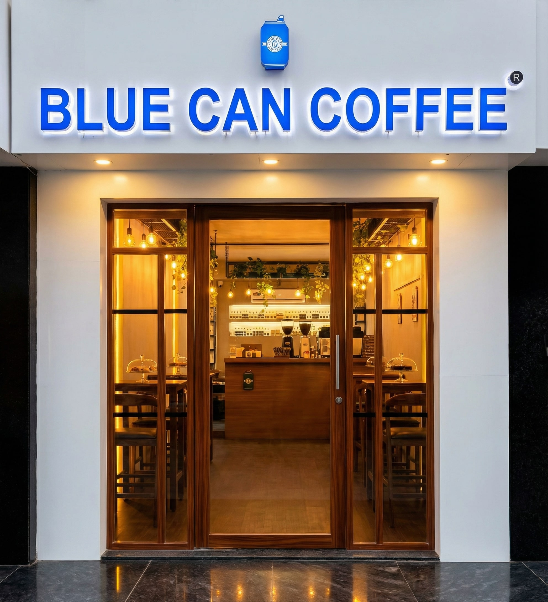

# ☕ Blue Can Coffee



<div align="center">

[](https://bluecancoffee.vercel.app)
[](https://react.dev)
[](https://www.typescriptlang.org/)
[](https://tailwindcss.com)
[](#-license)

**A premium, mobile-first digital experience for Surat's finest specialty coffee brand.** *Modern aesthetics. Seamless navigation. Performance-driven.*

[**View Live Demo**](https://bluecancoffee.vercel.app) · [**Report Bug**](https://github.com/your-username/blue-can-coffee/issues) · [**Request Feature**](https://github.com/your-username/blue-can-coffee/issues)

</div>

---

## 📌 Overview

**Blue Can Coffee** isn't just a website; it's a digital extension of the café's ambiance. Designed with a "vibes-first" approach, this project bridges the gap between physical hospitality and digital convenience. 

Built for speed and scalability, it leverages the modern React ecosystem to deliver a buttery-smooth user experience, complete with SEO optimization for local discovery in Surat, Gujarat.

---

## 🚀 Key Features

### 🎨 **Experience & UI**
- **Cinematic Hero Section:** Immersive visuals that capture the café's aesthetic immediately.
- **Glassmorphism & Micro-interactions:** Powered by `framer-motion` for a premium feel.
- **Responsive Design:** Flawless utility on all devices, from iPhone SE to 4K Desktops.

### ⚡ **Performance & Engineering**
- **Vite-Powered:** Instant HMR and optimized production builds.
- **Type-Safe:** 100% TypeScript codebase for robustness and maintainability.
- **SEO Optimized:** integrated `react-helmet-async` and JSON-LD Schema for rich search results (Local Business, Geo-coordinates).

### 🛒 **Business Logic**
- **Smart Menu System:** Categorized, filterable menu showcasing bestsellers.
- **External Order Integration:** Seamless bridging to Zomato/Swiggy for conversion.
- **Social Proof:** Google Reviews integration and dynamic trust badges.

---

## 🛠️ Tech Stack

This project uses a modern, opinionated stack focused on developer experience and end-user performance.

| Category | Technologies |
| :--- | :--- |
| **Core** | React 18, TypeScript, Vite |
| **Styling** | Tailwind CSS, Tailwind Merge, CLSX, Lucide React |
| **UI Components** | **Shadcn/UI** (Radix Primitives), Toast (Sonner) |
| **Animation** | Framer Motion, Tailwind Animate |
| **State & Data** | TanStack Query (React Query) |
| **Forms & Validation** | React Hook Form, Zod |
| **Routing & SEO** | React Router DOM, React Helmet Async |

---

## 📂 Project Structure

A scalable folder structure designed for feature-based growth.

```bash
src/
├── assets/          # Static assets (images, logos)
├── components/      # Modular UI components
│   ├── home/        # Landing page specific components (Hero, VibeSection)
│   ├── layout/      # Layout wrappers (Navbar, Footer, MobileNav)
│   ├── menu/        # Menu rendering logic
│   └── ui/          # Reusable primitives (Shadcn - Buttons, Modals, etc.)
├── data/            # Static data (Menu items, Business Links)
├── hooks/           # Custom React hooks (use-mobile, use-toast)
├── lib/             # Utilities (cn, formatters)
├── pages/           # Route views (Index, Menu, About, Contact)
└── main.tsx         # Entry point

```

---

## ⚙️ Local DevelopmentFollow these steps to get the café running on your local machine.

###Prerequisites* Node.js (v18+)
* npm or bun

###Installation1. **Clone the repository**
```bash
git clone [https://github.com/your-username/blue-can-coffee.git](https://github.com/your-username/blue-can-coffee.git)
cd blue-can-coffee

```


2. **Install dependencies**
```bash
npm install
# or
bun install

```


3. **Start the development server**
```bash
npm run dev

```


4. **Build for production**
```bash
npm run build

```


---

## 🛣️ Roadmap* [x] **Phase 1: Launch** - Core UI, Menu, and Deployment.
* [ ] **Phase 2: Engagement** - Instagram Feed integration & "Coffee of the Day" widget.
* [ ] **Phase 3: Admin** - Simple CMS for updating menu prices/items without code.
* [ ] **Phase 4: PWA** - Progressive Web App support for offline menu viewing.

---

## 🤝 ContributingContributions are what make the open-source community such an amazing place to learn, inspire, and create. Any contributions you make are **greatly appreciated**.

1. Fork the Project
2. Create your Feature Branch (`git checkout -b feature/AmazingFeature`)
3. Commit your Changes (`git commit -m 'Add some AmazingFeature'`)
4. Push to the Branch (`git push origin feature/AmazingFeature`)
5. Open a Pull Request

---

## 👤 Authors**Sahaj & Divy** *Full-Stack Developers & Caffeine Enthusiasts*

* **Sahaj:** [GitHub](https://www.google.com/search?q=https://github.com/sahaj33-op) · [Portfolio](https://sahaj33.vercel.app/)
* **Divy:** [GitHub](https://www.google.com/search?q=https://github.com/divyviradiya1501)

---

##📄 LicenseDistributed under the MIT License. See `LICENSE` for more information.

<div align="center">
<sub>Built with 💙 and ☕ in Surat, India.</sub>
</div>
